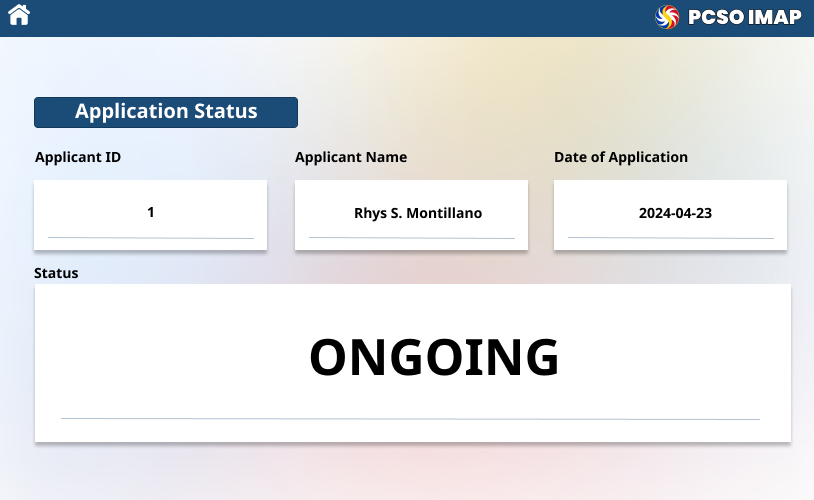
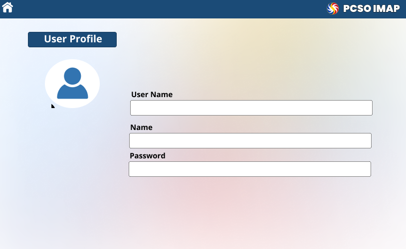

# PCSO IMAP APPLICATION DATABASE

Welcome to the Information Management Prerequisite Project repository! This project is designed as a prerequisite assignment for our Information Management course.

## Pre-requisites
###### Installing SQL Connector
You can install `mysql-connector-python` using `pip`, Python's package installer. Open your terminal or command prompt and enter the following command:
```bash
pip install mysql-connector-python
```
Note: If There Is An Error, Try Using `pip3` Instead Of `pip`, Or Add `--user` At The End Of The Command.

<p align="right">(<a href="#top">back to top</a>)</p>

## Screenshots

Take a look at some screenshots showcasing the intuitive application form and powerful admin control of our Job Application Portal.

<table>
   <tr>
        <td>
            
            <br />
            <p align="center">Landing Page</p></td>
        <td>
            
            <br />
            <p align="center">Sign Up</p></td>
    </tr>
    <tr>
        <td>
            
            <br />
            <p align="center">Admin Login</p></td>
        <td>
            
            <br />
            <p align="center">Applicant Login</p></td>
    </tr>
    <tr>
        <td>
            
            <br />
            <p align="center">Home Page</p></td>
        <td>
            
            <br />
            <p align="center">Admin</p></td>
    </tr>
    <tr>
        <td>
            
            <br />
            <p align="center">Register Page 1</p></td>
        <td>
            
            <br />
            <p align="center">Register Page 2</p></td>
    </tr>
    <tr>
        <td>
            
            <br />
            <p align="center">Applicant Status</p></td>
        <td>
            
            <br />
            <p align="center">User Profile</p></td>
    </tr>

</table> 

<p align="right">(<a href="#top">back to top</a>)</p>


## Introduction

The Philippine Charity Sweepstakes Office (PCSO) developed the Individual Medical Assistance Program (IMAP) applicant database to transform how medical assistance is provided throughout the Philippines. The goal is to improve data management effectiveness, simplify application procedures, and guarantee the safe handling of private and health-related data through careful database architecture. 

- This document serves as a comprehensive and detailed description of the database 
- Architecture for the Individual Medical Assistance Program (IMAP).
- It provides thorough documentation intended for future teams tasked with handling the design, development, and maintenance of the database system.

## Overview


The Individual Medical Assistance Program (IMAP) is a program that provides financial assistance to individuals with health-related problems to augment their funds in partnership with government and private hospitals, health facilities, medicine retailers, and other partners. The applicants search for financial assistance resources, as medical assistance can be expensive, submit a form, and comply with the needed documents for the PCSO IMAP. The form will consist of personal, household, and application details to provide information about the applicant’s background. 
 

A complete database system must be developed to manage Individual Medical Assistance Program (IMAP) applications, which are managed by the Philippine Charity Sweepstakes Office (PCSO). The objective is to make a system database of IMAP applications to protect sensitive personal and medical data; the database design will include strong data organization, effective query processing, and strict security measures. Ultimately, this system aims to ensure timely and targeted support for individuals in need of medical assistance by making a system of application records and tracking disbursements


## Features

- **Automated Form Gathering**: Extract and process form data from incoming emails.
- **Database Management**: Store and manage gathered data using SQL..
- **Data Analysis**: Generate reports and insights from the stored data.